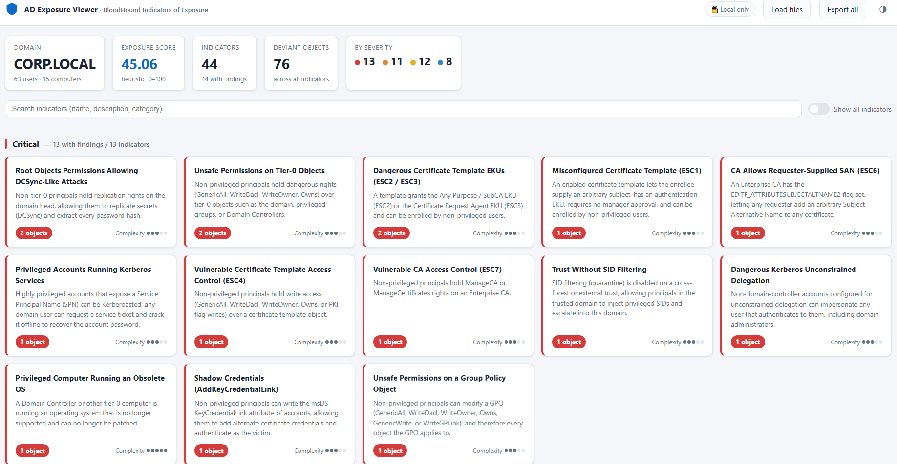

# AD Exposure Viewer — BloodHound Indicators of Exposure

A **client-only** web app that reads the JSON produced by `bloodhound-python`
(BloodHound CE / v5–v6) and presents Active Directory **Indicators of Exposure**.



All parsing and analysis run **in your browser**. No file is uploaded anywhere —
suitable for sensitive AD collection data.

## Run it

It is a static site. Any of these work:

- **Just open it:** double-click `index.html` (works from `file://`).
- **Serve it** (recommended, needed for the `?demo` autoload):

```bash
cd bh-ioe
python -m http.server 8777
# then open http://localhost:8777/
```

- **Deploy it:** copy the folder to any static host (Nginx, S3, GitHub Pages,
  Netlify…). There is no backend and no build step.

## Use it

1. Collect data: `bloodhound-python -d corp.local -u user -p pass -c All -ns <DC-IP>`
   → produces `*_users.json`, `*_computers.json`, `*_groups.json`, `*_domains.json`, `*_gpos.json`, `*_ous.json`, `*_containers.json`.
2. In the app click **Choose files** (select the JSON files), **Choose folder**,
   or drag-and-drop the files / folder / a `.zip` onto the page.
3. Browse indicators by severity, click a card for detail, use **Show all indicators**
   to include the ones with zero findings, and **Export all** / per-indicator **Export CSV**.
4. Each indicator's detail panel has a **BloodHound query** tab with the equivalent Cypher
   (copy-to-clipboard) so you can verify the same finding directly in BloodHound CE
   (*Explore → Cypher*).
   The full IoE-to-Cypher catalog, including checks this app does not implement, lives in
   `docs/modules/06-Identity-Exposure/REF-IoE-BloodHound-Cypher.md`.

Try it with the bundled synthetic data: `http://localhost:8777/?demo`.

## Indicators implemented

44 checks across Credential access, Delegation, ACL, Persistence, Hardening,
Credential hygiene, Least privilege, **ADCS**, **Group policy**, **Trust**,
**Hygiene and lifecycle** and **Entra ID** — e.g.
Kerberoastable / AS-REP-roastable accounts, unconstrained & constrained delegation,
DCSync rights, dangerous ACLs on tier-0 objects, Shadow Credentials, dangerous SID
history, obsolete OS, missing LAPS, dormant / old-password / never-expiring accounts,
oversized privileged groups, disabled accounts in privileged groups, machine-account
quota, and more.

**ADCS (Certified Pre-Owned):** ESC1 (enrollee-supplies-subject auth templates),
ESC2/ESC3 (Any-Purpose / Enrollment-Agent EKUs), ESC4 (vulnerable template ACLs),
ESC6 (CA `EDITF_ATTRIBUTESUBJECTALTNAME2`), ESC7 (ManageCA / ManageCertificates),
ESC9 (no security extension). Reads `*_certtemplates.json`, `*_enterprisecas.json`.

**Group policy:** unsafe permissions on a GPO (WriteDacl/WriteOwner/GenericAll/
GenericWrite/Owns/WriteGPLink by non-tier-0 principals) and unlinked / orphaned GPOs
(derived from OU/domain link data). Reads `*_gpos.json` + `*_ous.json`/`*_domains.json` links.

**Trust:** SID filtering disabled on a cross-forest/external trust, TGT delegation enabled
across a trust, transitive external trusts, and trusts pointing at domains that were not
collected (analysis blind spots). Reads the `Trusts` array of `*_domains.json`, accepting both
the string enums used by BloodHound CE and the integer enums of older collectors.
Intra-forest trusts (`ParentChild` / `CrossLink`) are deliberately **not** flagged for missing
SID filtering, because the forest — not the domain — is the security boundary there.

**Hygiene and lifecycle:** mirrors the Identity Exposure detection family of the same name —
tier-0 computers on an unsupported OS, privileged accounts that are dormant or never used,
dormant Domain Controllers, empty / single-member privileged groups, duplicate sAMAccountName
and replication-conflict (`CNF:`) objects, and empty / single-member ordinary groups.
Built-in groups are excluded from the ordinary-group check because AD creates many of them
empty by design. Mapping of all 40 weaknesses in that family is in
`docs/modules/06-Identity-Exposure/REF-Exposure-Center-Hygiene-Lifecycle.md`.

**Entra ID:** dormant / never-used privileged users, dormant / never-used ordinary users,
dormant / never-used registered devices, and empty / single-member groups (role-assignable
groups are called out). These read an **AzureHound** export, because `bloodhound-python`
does not collect Entra ID at all — drop the AzureHound `.json` in alongside the AD files.
Privileged means holding one of the tier-0 directory roles (Global Administrator,
Privileged Role Administrator, …), resolved through role-assignable groups as well.

When no AzureHound file is loaded these four indicators are reported as **not assessed**
rather than clean: they are hidden from the grid and counted separately in the header, so
the dashboard never claims Entra ID is healthy on the strength of AD-only data.

## Project layout

```
bh-ioe/
├── index.html          # page shell (loads the scripts below)
├── styles.css          # theme (light/dark), layout
├── data/catalog.js     # indicator catalog: metadata + descriptive text
├── data/cypher.js      # BloodHound Cypher equivalent per indicator
├── js/bloodhound.js    # BloodHound CE parser + graph normalizer
├── js/checks.js        # detection logic, one function per indicator
├── js/app.js           # file loading, scoring, rendering, detail panel, CSV
├── imgs/               # screenshots and project images
│   └── Untitled.png
└── sample/             # synthetic dataset generator + generated *_*.json
    └── generate_sample.py
```

## Adding a new indicator

1. Add an entry to `data/catalog.js` with a unique `id`, `criticity`, `complexity`
   and descriptive text.
2. Add a detection function with the same `id` in `js/checks.js` returning an array
   of deviant objects `{ sid, name, type, dn, reasons[], attrs{} }`.
3. Optionally add `{ ioe, query }` under the same `id` in `data/cypher.js` to give the
   indicator a **BloodHound query** tab.

That is all — the UI, scoring, and export pick it up automatically.

## Notes & limitations

- Built to the documented BloodHound CE schema. bloodhound-python property names are
  lower-cased; if a field is named differently in your export, the relevant check just
  returns nothing (it never crashes) — adjust the field name in `js/checks.js`.
- Thresholds (old password 180d, dormant 90d, group-size limits) are constants at the
  top of `js/checks.js`.
- "Reference now" for age-based checks is the newest timestamp in the data (or the wall
  clock if the collection is recent), so old exports don't mark everything dormant.
- ADCS checks read template/CA flags and enrollment/ACL rights from the raw JSON; they
  approximate what BloodHound computes as ESC edges (they do not verify the template is
  published on an enabled, NTAuth-trusted CA), so treat them as strong leads to confirm.
- Entra ID sign-in timestamps (`signInActivity`) require `AuditLog.Read.All` and an Entra ID
  P1/P2 licence. If the export carries none, the "never signed in" case is skipped entirely
  rather than flagging every account.
- Trust checks depend on fields the collector may omit: `SidFilteringEnabled` and
  `TGTDelegationEnabled` are treated as "not collected" when absent rather than as `false`,
  so a missing field never produces a finding.
